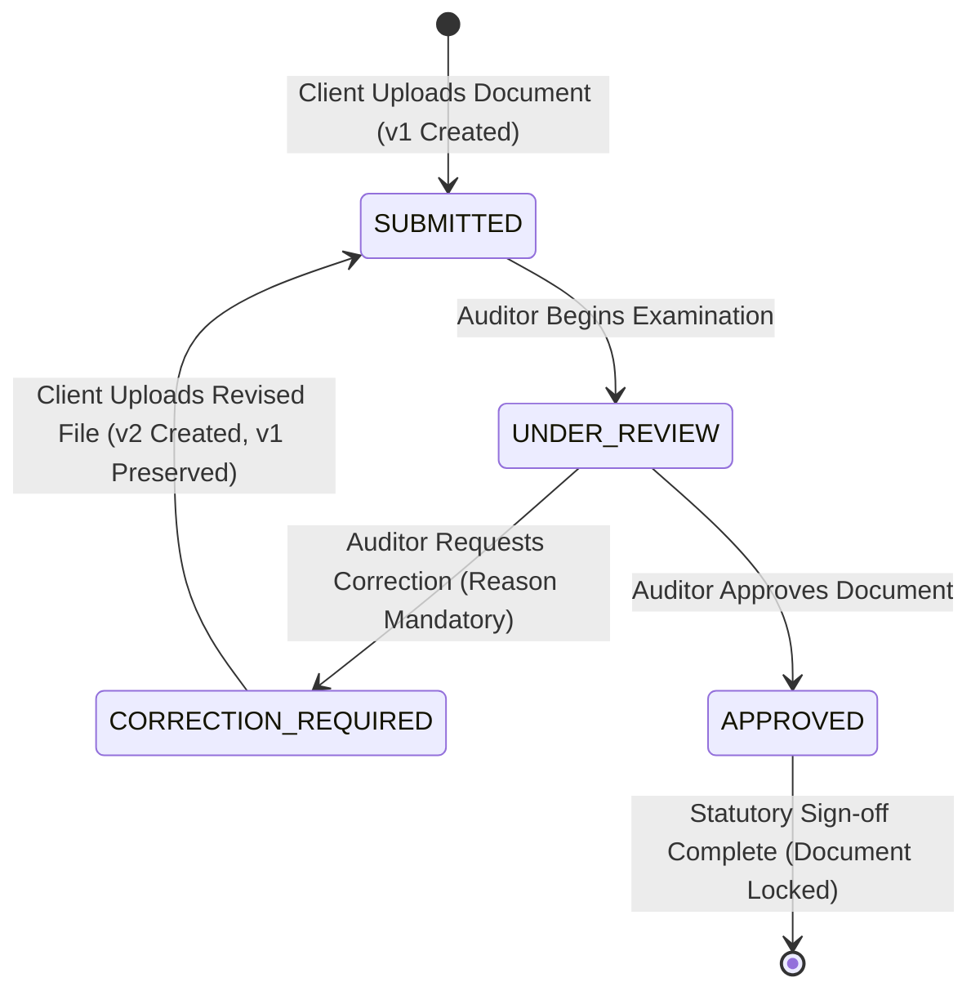

# TRACERA

> A calm, precise, document-centric audit workflow platform engineered for Chartered Accountant (CA) firms to collect, review, correct, and certify client financial records with an immutable Section 143(3) audit trail.

[](https://tracera-teal.vercel.app)
[](https://opensource.org/licenses/MIT)
[-black?style=flat&logo=next.js)](https://nextjs.org/)
[]()

**Live Application**: [https://tracera-teal.vercel.app](https://tracera-teal.vercel.app)

---

## Overview

For Chartered Accountant firms and audit practitioners, statutory audit engagements involve continuous, high-stakes document exchange. However, this workflow frequently fractures across disconnected channels:

$$\text{WhatsApp} + \text{Excel} + \text{Email} + \text{Google Drive} + \text{Manual Phone Follow-ups}$$

This fragmentation introduces critical operational and compliance failures:
- **Missing Invoices & Attachments**: Supporting documents sent across WhatsApp chats get buried without audit context or indexation.
- **Untracked Version Overwrites**: Conflicting spreadsheets named `Final_v2_edit.xlsx` overwrite previous client formulas with zero audit traceability.
- **Drowned Email Threads**: Auditor correction requests get lost in client inboxes, jeopardizing statutory filing deadlines.
- **Compliance Exposure**: Under Section 143(3) of the Companies Act, auditors must maintain tamper-evident proof of review, inquiry, and verification.

---

## Why TRACERA

TRACERA replaces fragmented communication channels with **one unified, traceable audit system**. 

| Fragmented Approach | TRACERA Approach |
| :--- | :--- |
| Unindexed WhatsApp photos & PDFs | Direct client upload portal with structured metadata & document categorization |
| Overwritten spreadsheet versions | Immutable version preservation ($v_1, v_2, v_3 \dots$)—prior files are never destroyed |
| Buried email revision requests | Prominent **Action Required** correction notices with mandatory auditor remarks |
| Verbal follow-ups & missed deadlines | Real-time notification stream, review urgency tracking, and automated reminders |
| Unsubstantiated audit opinions | Append-only chronological audit trail capturing actor, role, version, and timestamp |

---

### The CA Engagement Operating System

TRACERA elevates practice management from isolated document reviews to an integrated CA engagement lifecycle:

$$\text{CLIENT} \longrightarrow \text{ENGAGEMENT} \longrightarrow \text{WORKFLOW} \longrightarrow \text{TASKS + DOCUMENTS} \longrightarrow \text{REVIEW} \longrightarrow \text{CORRECTIONS} \longrightarrow \text{APPROVAL} \longrightarrow \text{CLOSURE} \longrightarrow \text{AUDIT TRAIL}$$

#### The Signature Audit Room Workspace (`/engagements/[id]`)
Each client audit engagement operates within a dedicated workspace featuring an interactive 10-stage gate progress bar and 8 specialized sub-tabs:

1. **Overview**: Executive portfolio summary, team ownership (Lead Partner, Practice Manager, Staff Performer), statutory due date, and billing totals.
2. **Workflow Stages**: Full sequential operational progression (from Stage 01 Acceptance to Stage 10 Closure) with owner assignment, audit notes, and stage advancement gates.
3. **Document Evidence Checklist**: 12 mandatory CA audit documents categorized into Financials, Banking, Purchases & GST, Sales, and Statutory Compliance. Auditor can issue structured document requests with due dates directly to the client.
4. **Tasks & Fieldwork**: Procedure tracking with urgency pills (`URGENT`, `HIGH`, `MEDIUM`) and active blocker alerting (e.g. `Blocked by: Client - Missing June Bank Statement`).
5. **Maker-Checker Approvals**: Enforced 3-tier sequence (Staff Performer $\rightarrow$ Manager Reviewer $\rightarrow$ Lead CA Partner Sign-off) with cryptographic audit timestamps.
6. **Billing & Fees**: Professional fee computation (Base Audit Fee ₹25,000 + 18% GST ₹4,500 = ₹29,500) with payment recording and receipt tracking.
7. **Unified Timeline**: Append-only chronological audit trail harmonizing high-level engagement milestones and granular document-level actions.
8. **Engagement Closure**: 5-point formal gate verification. When all 5 prerequisites pass, the partner seals the engagement with an immutable Closure ID (`AUD-2026-XXXXX`) and generates the official signed CA Closure Dossier PDF.

---

### Document-Level Workflow

TRACERA also enforces a strict 5-stage statutory lifecycle for individual financial records:

```
CLIENT                              AUDITOR
  │                                    │
  ├─── 01. UPLOAD (v1 Created) ───────>│ [Appears in Review Queue as SUBMITTED]
  │                                    ├─── 02. REVIEW (Starts Review → UNDER_REVIEW)
  │                                    │    (Checks 4-point CA checklist)
  │                                    │
  │<── 03. CORRECTION REQUESTED ───────┤ (Status: CORRECTION_REQUIRED with mandatory reason)
  │    (Prominent Action Required)     │
  │                                    │
  ├─── 04. RE-UPLOAD (v2 Created) ────>│ [Reappears in Review Queue at v2, v1 preserved]
  │                                    │
  │                                    ├─── 05. APPROVAL & AUDIT CERTIFICATION
  │<── Certified PDF Audit Report ─────┤    (Status: APPROVED, File Locked, PDF Generated)
```

1. **Upload**: Client submits the document (Bank Statement, Purchase Register, GST Return, Invoice). Document enters state `SUBMITTED` as Version 1 ($v_1$).
2. **Review**: Assigned auditor opens the split-screen Review Workspace, transitioning status to `UNDER_REVIEW`. Line items are verified against the 4-point CA statutory checklist.
3. **Correction**: If discrepancies exist, auditor requests a correction with a mandatory explanation. Status transitions to `CORRECTION_REQUIRED`. Client sees an **Action Required** notice.
4. **Re-upload**: Client submits Version 2 ($v_2$). Version 1 ($v_1$) is preserved immutably.
5. **Approval**: Auditor reviews the corrected version, verifies math and counterpart data (e.g. GSTR-2B), and issues official sign-off. Status becomes `APPROVED`.
6. **Audit Trail**: Every event is permanently recorded in the Section 143(3) chronological audit ledger.

---

## Role-Based Architecture & Portals

TRACERA supports four distinct roles with strict access-control boundaries:

| Role | Responsibilities | Dedicated Portal |
| :--- | :--- | :--- |
| **`CLIENT`** | Submits required audit evidence, views correction notices, re-uploads revised versions ($v_2$), and downloads certified reports. | `/client/dashboard` |
| **`AUDITOR`** | Reviews submitted documents, executes fieldwork checklists, raises structured correction requests, and approves reconciled records. | `/auditor/dashboard` |
| **`PARTNER`** | Conducts final quality gates, executes maker-checker partner sign-offs, settles billing, and officially closes engagements. | `/partner/dashboard` |
| **`ADMIN`** | Provisions team credentials, configures practice settings, inspects full audit logs, and accesses evaluation benchmarking tools. | `/admin/dashboard` |

### Registration & 1-Click Access on `/signup`
- **Dynamic Role Switcher**: Users can register as **Client Org**, **Auditor**, or **CA Partner** with dynamic form fields and automatic workspace provisioning.
- **Instant Dashboard Access**: High-contrast Neo-Brutalist buttons allow 1-click evaluation of any role without manual credentials:
  - **Client Portal**: `client@demo.com` $\to$ `/client/dashboard`
  - **Auditor Console**: `auditor@demo.com` $\to$ `/auditor/dashboard`
  - **Partner Suite**: `partner@demo.com` $\to$ `/partner/dashboard`

---

## Seed Evaluation Credentials

All pre-seeded demo accounts use the standard password: `Demo@123456`

| Account Name | Role | Email | Direct Dashboard |
| :--- | :--- | :--- | :--- |
| **Client Portal** | `CLIENT` | `client@demo.com` | `/client/dashboard` |
| **Auditor Rahul** | `AUDITOR` | `auditor@demo.com` | `/auditor/dashboard` |
| **CA Partner Vikram** | `PARTNER` | `partner@demo.com` | `/partner/dashboard` |
| **Practice Admin** | `ADMIN` | `admin@demo.com` | `/admin/dashboard` |

---

## Architecture & Security

```
┌─────────────────────────────────────────────────────────────────────────┐
│                           TRACERA Web Client                            │
│           Next.js 16 (App Router) + React 19 + Tailwind CSS             │
│            Poppins Typography + Precision Neo-Brutalist UI              │
└────────────────────────────────────┬────────────────────────────────────┘
                                     │ HTTP / Cookie Session Auth
                                     ▼
┌─────────────────────────────────────────────────────────────────────────┐
│                    Next.js 16 Edge Proxy (src/proxy.ts)                 │
│    • Optimistic Route Protection       • Protected Path Filtering       │
│    • Graceful 401/403 Redirection      • Stale Session Cleanup          │
└────────────────────────────────────┬────────────────────────────────────┘
                                     │
                                     ▼
┌─────────────────────────────────────────────────────────────────────────┐
│                         Next.js API Route Layer                         │
│    • Authoritative Session Guards      • Multi-Tenant Isolation         │
│    • Workflow Action Engine            • Private Streaming Downloads    │
│    • PDF Closure Dossier Generator     • In-App Event Notifications     │
└────────────────────────────────────┬────────────────────────────────────┘
                                     │
                                     ▼
┌─────────────────────────────────────────────────────────────────────────┐
│                         Central Workflow Service                        │
│   submitDocument() · startReview() · requestCorrection() ·              │
│   uploadCorrection() · approveDocument() · closeEngagement()            │
└──────────────┬─────────────────────┬──────────────────────┬─────────────┘
               │                     │                      │
               ▼                     ▼                      ▼
┌────────────────────────┐ ┌──────────────────┐ ┌─────────────────────────┐
│ OCR Extraction Engine  │ │ Validation Rules │ │ Notification Service    │
│ (Structured Fields)    │ │ (Statutory Math) │ │ (Real-Time Streams)     │
└────────────────────────┘ └──────────────────┘ └─────────────────────────┘
               │                     │                      │
               └─────────────────────┼──────────────────────┘
                                     ▼
┌─────────────────────────────────────────────────────────────────────────┐
│                            Persistence Layer                            │
│  • Local Store: SQLite WAL (.data/tracera.db) with Atomic Transactions   │
│  • Private Storage: .data/storage/documents/ with UUID storage keys     │
│  • Cloud Mirror: MongoDB Atlas & Firebase Storage (Optional)            │
│  • Append-Only Audit Log: Tamper-Evident Chronological History          │
└─────────────────────────────────────────────────────────────────────────┘
```

- **Private Storage**: Uploaded files are strictly stored outside the public directory in `.data/storage/documents/`. Files are streamed via `/api/documents/[id]/download` only after verifying organizational permissions.
- **Session Auto-Cleanup**: `getCurrentUser()` automatically clears stale or expired session cookies to prevent redirect bounce loops.
- **Scrypt Password Hashing**: Passwords use Node.js `crypto.scrypt` with random salts and constant-time comparison (`crypto.timingSafeEqual`).

---

## Tech Stack

- **Framework**: [Next.js 16](https://nextjs.org/) (App Router, Turbopack)
- **UI & Components**: [React 19](https://react.dev/), [Tailwind CSS](https://tailwindcss.com/), [Lucide Icons](https://lucide.dev/)
- **Design System**: Neo-Brutalist aesthetic (2px solid borders, hard drop shadows, signal accents)
- **Typography**: [Google Fonts Poppins](https://fonts.google.com/specimen/Poppins) (weights 400 through 900) mapped across all UI and monospace tokens
- **Local Persistence**: [SQLite](https://www.sqlite.org/) with WAL mode via `better-sqlite3` and atomic transactions
- **Cloud Database (Optional)**: [MongoDB Atlas](https://www.mongodb.com/atlas) with [Mongoose](https://mongoosejs.com/)
- **Document Storage**: Local filesystem private store with [Firebase Storage](https://firebase.google.com/products/storage) support
- **Authentication**: Role-based session cookies with Firebase Auth token verification
- **PDF Generation**: [jsPDF](https://github.com/parallax/jsPDF) server-side dossier compilation

---

## Workflow State Machine

The state machine strictly enforces valid lifecycle transitions:



### Transition Enforcement Rules:
- `SUBMITTED → APPROVED`: **BLOCKED** (Auditor must first begin review).
- `SUBMITTED → CORRECTION_REQUIRED`: **BLOCKED** (Must be in review).
- `APPROVED → SUBMITTED`: **BLOCKED** (Approved documents are permanently locked).
- `APPROVED → CORRECTION_REQUIRED`: **BLOCKED** (Cannot revise certified record).
- `CORRECTION_REQUIRED → APPROVED`: **BLOCKED** (Client must upload corrected version first).

---

## Local Setup

### 1. Clone & Install
```bash
git clone https://github.com/sukrut07/Tracera.git
cd Tracera
npm install
```

### 2. Environment Setup
```bash
cp .env.example .env.local
```
*Note: TRACERA runs immediately out of the box using the pre-configured local SQLite WAL store (`.data/tracera.db`). No external cloud services or API keys are required to evaluate the entire system.*

### 3. Seed Demo Data (Optional)
```bash
npm run seed:demo
```

### 4. Start Development Server
```bash
npm run dev
```
Open [http://localhost:3000](http://localhost:3000) in your browser.

---

## Automated Test Suites (100% Passing)

TRACERA includes three end-to-end automated verification suites:

### 1. CA Engagement Operating System Suite (15/15 Tests Passing)
Tests the complete 15-step CA statutory engagement lifecycle: creation, sequential 10-stage advancement, checklist evidence approval, task blocker resolution, 3-tier maker-checker sign-offs, fee settlement, 5/5 closure gate checks, and official signed dossier PDF generation:
```bash
npm run test:engagement
```

### 2. Document Workflow State Machine Suite (8/8 Tests Passing)
Tests atomic transitions, multi-version preservation ($v_1 \to v_2$), permission boundaries (403 when client attempts approval or auditor attempts correction upload), and Section 143(3) immutable audit trails:
```bash
npm run test:workflow
```

### 3. Live HTTP Route & Session Auth Suite (11/11 Tests Passing)
Tests live HTTP session cookies, role isolation, multi-round reviews, notifications, and download security against the running server:
```bash
npm run test:http
```

### Code Quality & Compilation
```bash
npm run lint    # 0 errors
npm run build   # 0 errors (40/40 routes compiled cleanly with Turbopack)
```

---

## Evaluation & Synthetic Benchmark Fixtures

All test datasets use public synthetic benchmarks:

| Fixture | Origin / Benchmark | Test Scenario / Audit Purpose |
| :--- | :--- | :--- |
| **HDFC Current Account Q1** | [AgamiAI Indian Bank Statements](https://huggingface.co/datasets/AgamiAI/Indian-Bank-Statements) | Business banking statement with UPI, NEFT, IMPS, and RTGS clearing entries |
| **Purchase Register FY24-25 (v1)** | [Synthetic Indian Finance Data](https://github.com/AnujSureshkumar/synthetic-finance-data) | Contains missing invoice INV-204 to test **CORRECTION_REQUIRED** cycle |
| **Purchase Register FY24-25 (v2)** | [Synthetic Indian Finance Data](https://github.com/AnujSureshkumar/synthetic-finance-data) | Reconciled register with INV-204 added for auditor **APPROVAL** |
| **GSTR-2B Auto-Drafted ITC** | GST Portal Auto-Drafted ITC | Counterpart tax return data for purchase register reconciliation |
| **Balaji Enterprises Tax Invoice** | [Invoice Sandbox Benchmark](https://github.com/ciru-ai/invoice-sandbox-benchmark) | Statutory ₹76,700 GST invoice (INV-204) with HSN 7208 & E-Way Bill |
| **Form 26AS TDS Summary** | CBDT Tax Deducted at Source | Section 194C / 194J contractor & professional tax credit verification |

---

## Security & Compliance Disclosure

- **Multi-Tenant Client Isolation**: All document queries are filtered by authenticated `client_id`.
- **Tamper-Evident Logs**: Audit log entries are strictly append-only. No endpoint exists to delete or modify historical logs.
- **Section 143(3) Compliance**: Designed to satisfy statutory audit standards under Section 143(3) of the Indian Companies Act, 2013.
- **Human-in-the-Loop Mandate**: AI and OCR extraction features are strictly advisory. **AI will never automatically approve, reject, or certify an audit document.** Only a verified Chartered Accountant can issue statutory approvals.

---

## Repository & License

- **Live Application**: [https://tracera-teal.vercel.app](https://tracera-teal.vercel.app)
- **GitHub**: [https://github.com/sukrut07/Tracera](https://github.com/sukrut07/Tracera)
- **License**: MIT