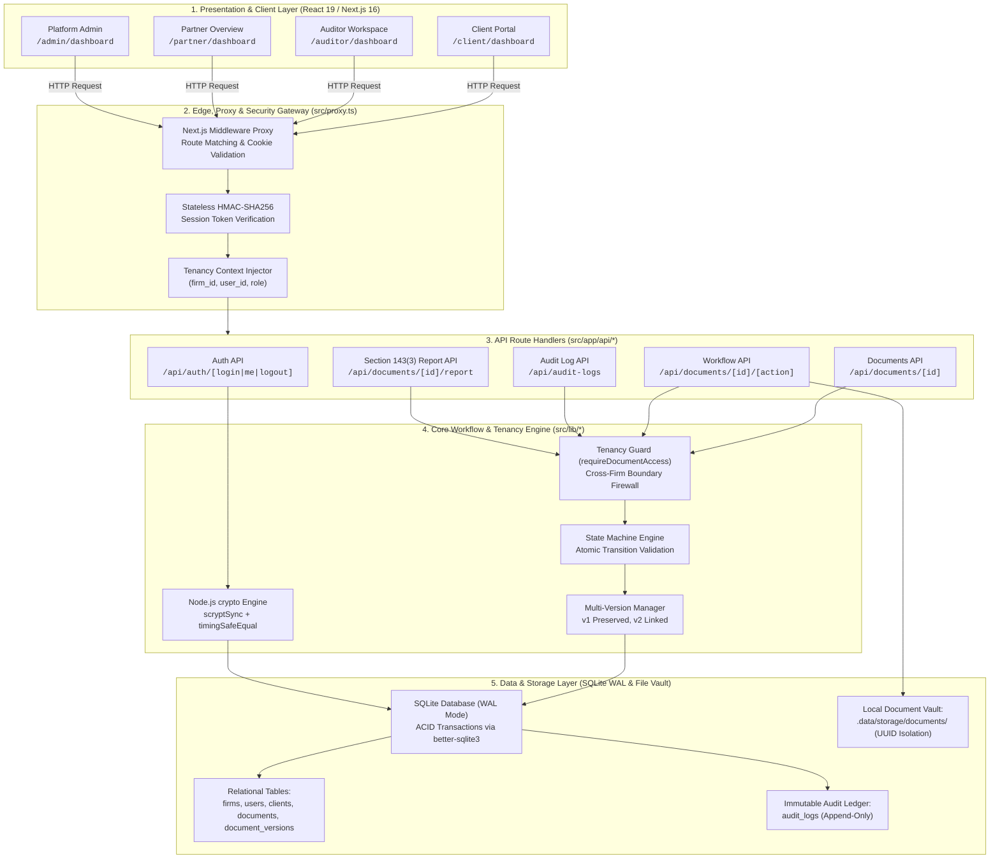
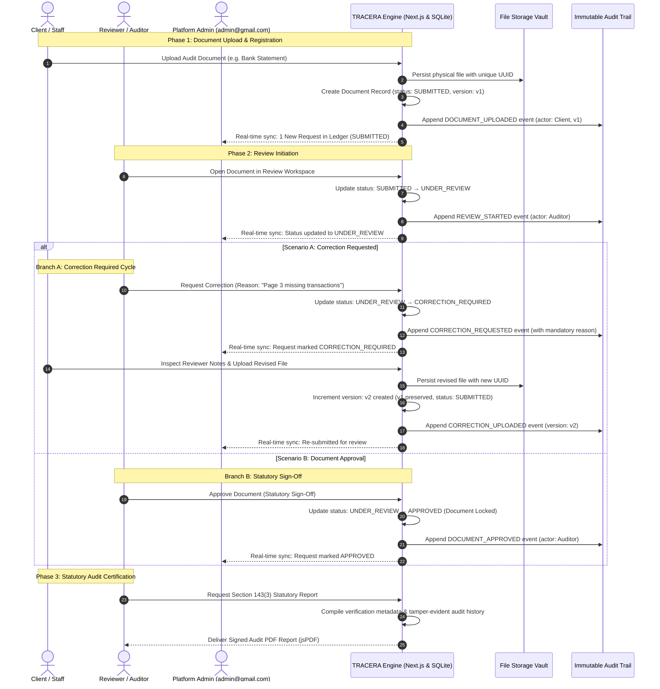
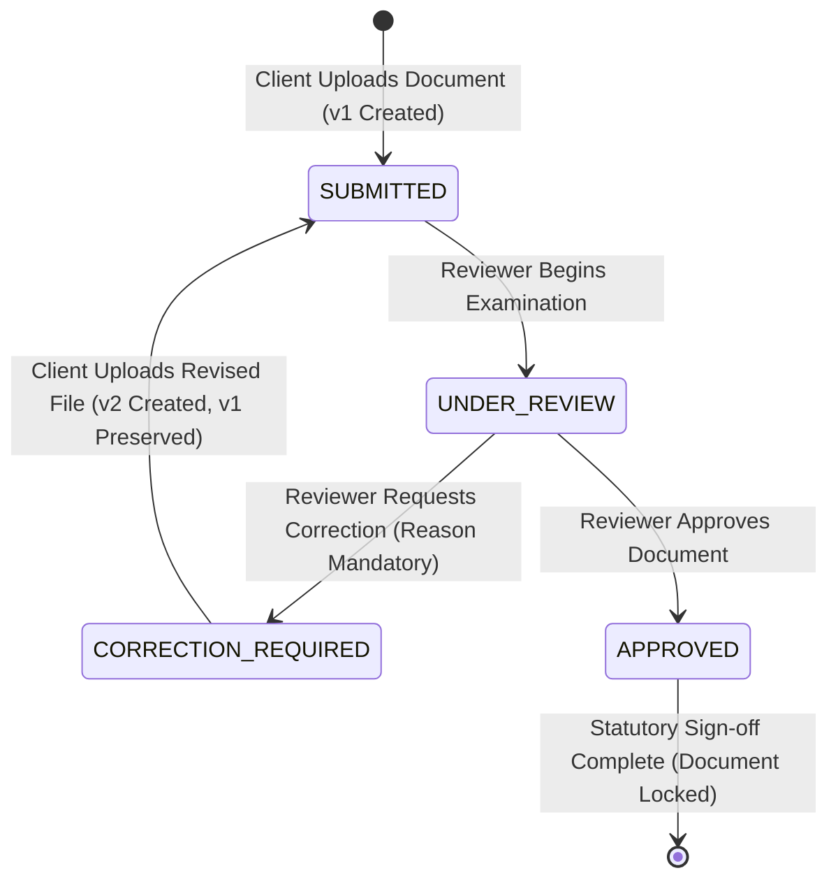

# TRACERA — Mini Audit Document Review System

> A calm, precise, document-centric audit review platform engineered for Chartered Accountant (CA) firms to collect, review, correct, and approve client audit documents with an immutable audit trail and strict multi-firm tenant isolation.

[](https://tracera-teal.vercel.app)
[](https://opensource.org/licenses/MIT)
[-black?style=flat&logo=next.js)](https://nextjs.org/)
[]()

**Live Application**: [https://tracera-teal.vercel.app](https://tracera-teal.vercel.app)  
**GitHub Repository**: [https://github.com/sukrut07/Tracera](https://github.com/sukrut07/Tracera)

---

## 1. Core Workflow & Scope

TRACERA delivers the complete end-to-end Mini Audit Document Review workflow:

$$\mathbf{Create/View\ Client} \longrightarrow \mathbf{Add\ Audit\ Documents} \longrightarrow \mathbf{Review\ Documents} \longrightarrow \mathbf{Approve\ or\ Request\ Correction} \longrightarrow \mathbf{View\ Audit\ History}$$

### Step 1 — Client
Create, view, and manage clients within the CA firm (e.g. *Acme Corp* / *ABC Traders Pvt. Ltd.* for Firm A; *Zenith Technologies* for Firm B).

### Step 2 — Required Audit Documents
For each client, track and manage the standard audit document checklist:
- **Bank Statement**
- **Sales Register**
- **Purchase Register**
- **GST Return / Document**
- **Expense Summary**
- Supporting Invoices & TDS Certificates

### Step 3 — Document Review Workspace
Reviewers examine documents with full context:
- Document name & type
- Client name & organization
- Uploaded by & upload timestamp
- Current status (`SUBMITTED`, `UNDER_REVIEW`, `CORRECTION_REQUIRED`, `APPROVED`)
- Review comments and version history ($v_1, v_2$)

Reviewers can:
- **Approve**: Issues statutory sign-off and permanently locks the document version.
- **Request Correction**: Adds a mandatory reason (e.g., *"Page 3 is missing. Please upload the complete bank statement."*). The document immediately moves to **Correction Required**, alerting the client to upload a revised version ($v_2$).

### Step 4 — Immutable Audit History
Every important action generates an append-only audit event capturing:
- **Who** performed the action (actor name & role)
- **What** happened (`DOCUMENT_UPLOADED`, `REVIEW_STARTED`, `CORRECTION_REQUESTED`, `CORRECTION_UPLOADED`, `DOCUMENT_APPROVED`)
- **When** it occurred (exact timestamp)
- **Which document** and version it affected ($v_1, v_2$)
- **Why** (mandatory correction reason or reviewer remarks)

The audit log is **strictly append-only** and **cannot be edited or deleted** by normal users.

---

## 2. Multi-Firm Tenant Isolation

TRACERA supports multiple CA firms on a single deployment with complete data and operational isolation:

- **Firm A**: `ABC & Co.` (`firm-abc`)
- **Firm B**: `XYZ & Co.` (`firm-xyz`)

### Multi-Tenant Demonstration Accounts

| Firm | Role | User Name | Email | Password | Direct Dashboard |
| :--- | :--- | :--- | :--- | :--- | :--- |
| **All Firms (Governance)** | `ADMIN` (Platform Admin) | Platform Administrator | `admin@gmail.com` | `12345678` | `/admin/dashboard` |
| **Firm A (ABC & Co.)** | `AUDITOR` (Reviewer) | Auditor Rahul | `auditor@demo.com` | `Demo@123456` | `/auditor/dashboard` |
| **Firm A (ABC & Co.)** | `CLIENT` (Staff/Client) | Acme Client Portal | `client@demo.com` | `Demo@123456` | `/client/dashboard` |
| **Firm A (ABC & Co.)** | `PARTNER` | CA Partner Vikram | `partner@demo.com` | `Demo@123456` | `/partner/dashboard` |
| **Firm B (XYZ & Co.)** | `AUDITOR` (Reviewer) | Auditor Priya (XYZ) | `auditor@xyz.com` | `Demo@123456` | `/auditor/dashboard` |
| **Firm B (XYZ & Co.)** | `CLIENT` (Staff/Client) | Zenith Client Portal | `client@xyz.com` | `Demo@123456` | `/client/dashboard` |
| **Firm B (XYZ & Co.)** | `PARTNER` | CA Partner Sanjay | `partner@xyz.com` | `Demo@123456` | `/partner/dashboard` |

---

## 3. Technical Architecture, Tools & Workflow Diagrams

### 3.1 Comprehensive Tools & Technology Stack

| Category | Technology / Tool | Version | Purpose in TRACERA |
| :--- | :--- | :--- | :--- |
| **Core Web Framework** | [Next.js (App Router)](https://nextjs.org/) | `16.3.5` | Unified full-stack framework with React Server Components, Route Handlers, Turbopack, and edge middleware. |
| **Frontend UI Library** | [React](https://react.dev/) | `19.2.8` | Component-driven presentation layer with optimistic state rendering and client-side transitions. |
| **Language & Type System** | [TypeScript](https://www.typescriptlang.org/) | `5.x` | Strict type safety across database schemas, API contracts, workflow state machines, and session contexts. |
| **Database Engine** | [better-sqlite3](https://github.com/WiseLibs/better-sqlite3) | `13.0.3` | High-performance embedded SQLite engine running with Write-Ahead Logging (`WAL`), foreign key enforcement, and atomic ACID transactions. |
| **Styling & Design System** | [Tailwind CSS](https://tailwindcss.com/) | `4.x` | Modern utility-first CSS styling with custom Neo-Brutalist design tokens (ink borders, sharp tactile shadows, high-contrast badges). |
| **Typography** | [@fontsource/poppins](https://fontsource.org/fonts/poppins) | `5.2.8` | Crisp, legible geometric sans-serif typography (weights 400 through 900) optimized for data-dense audit tables. |
| **Icons & Micro-Interactions** | [Lucide React](https://lucide.dev/) | `1.47.0` | Comprehensive vector iconography for audit statuses, document types, file operations, and security badges. |
| **Animation Engine** | [Framer Motion](https://www.framer.com/motion/) | `13.4.0` | Fluid micro-interactions, modal transitions, and responsive status changes across review workspaces. |
| **Cryptographic Security** | Node.js `crypto` | Native | `scryptSync` with unique salt per user for password hashing, `timingSafeEqual` constant-time comparison, and dual HMAC-SHA256 stateless session tokens. |
| **Statutory PDF Reporting** | [jsPDF](https://github.com/parallax/jsPDF) | `4.2.1` | Programmatic vector PDF generation for Section 143(3) statutory audit engagement closure certification summaries. |
| **Test Execution Suite** | [tsx](https://github.com/privatenumber/tsx) | `4.23.13` | Zero-config TypeScript execution engine running automated multi-firm tenant isolation and state machine verification suites. |
| **Deployment Platform** | [Vercel](https://vercel.com/) | Cloud | Production serverless hosting with stateless HMAC session cookie verification. |

---

### 3.2 System Architecture & Technical Flow



---

### 3.3 End-to-End Operational Workflow & Review Lifecycle



---

### 3.4 How Firm A Stays Isolated From Firm B

TRACERA enforces defense-in-depth tenant isolation across four distinct layers, grounded in the principles that **Authentication ≠ Authorization** and **Frontend hiding a button ≠ Security**:

1. **Identity Tenancy Binding**: Every user record in the database is permanently assigned a `firm_id` (`firm-abc` for ABC & Co.; `firm-xyz` for XYZ & Co.). Upon authentication, this tenancy context is validated on the backend and embedded into the session identity (`user.firm_id`).
2. **Backend Route-Level Authorization (`requireDocumentAccess`)**: When any API route handler (`/api/documents/[id]`, `/api/documents/[id]/correction`, `/api/documents/[id]/download`) is invoked, the backend never trusts client parameters. It queries the target document, inspects `document.firm_id`, and verifies `user.firm_id === document.firm_id`. If an auditor or staff from Firm A attempts to access or modify a document owned by Firm B, the request is blocked with an authoritative **HTTP 403 Forbidden** before executing any business logic.
3. **Database-Level Query Scoping**: Collection endpoints (`GET /api/documents`, `GET /api/clients`) enforce tenancy at the database query layer (`WHERE d.firm_id = ?`). Even if a malicious user attempts ID enumeration or URL guessing, Firm A's database queries will never return Firm B's clients or documents.
4. **Service Engine Invariants**: The core workflow engine (`workflowService.submitDocument`, `startReview`, `requestCorrection`, `uploadCorrection`, `approveDocument`) validates tenant matching independently of the HTTP layer, guaranteeing that background processes or script executions cannot cross firm boundaries.

This isolation is formally verified by an automated test suite (`npm run test:tenant`), which executes cross-tenant intrusion tests between Firm A and Firm B and confirms all cross-firm read, write, and review operations are rejected with HTTP 403.

---

## 4. Roles & Responsibilities

| Role | Permitted Actions | Dedicated Portal |
| :--- | :--- | :--- |
| **Platform Administrator** | • Global oversight across all CA firms<br>• Real-time cross-dashboard request audit ledger<br>• Filter all requests (`APPROVED`, `SUBMITTED`, `UNDER_REVIEW`, `CORRECTION_REQUIRED`)<br>• Tenant-wide governance and security inspection | `/admin/dashboard` |
| **Staff / Client** | • View assigned clients<br>• Upload required audit documents<br>• View real-time document status<br>• Respond to correction requests by uploading revised versions ($v_2$) | `/client/dashboard` |
| **Reviewer / Auditor** | • View submitted client documents<br>• Open split-screen Review Workspace (`UNDER_REVIEW`)<br>• Approve documents (`APPROVED`)<br>• Request corrections with mandatory comments (`CORRECTION_REQUIRED`)<br>• Inspect immutable audit history | `/auditor/dashboard` |
| **Partner (Optional)** | • Oversee cross-firm practice metrics<br>• Conduct quality control gates and sign-offs<br>• Inspect full firm-wide audit logs | `/partner/dashboard` |

---

## 5. Document Lifecycle State Machine



### Transition Invariants
- `SUBMITTED → APPROVED`: **Blocked** (Reviewer must first begin examination).
- `SUBMITTED → CORRECTION_REQUIRED`: **Blocked** (Must be under active review).
- `APPROVED → SUBMITTED`: **Blocked** (Approved documents are permanently locked).
- `APPROVED → CORRECTION_REQUIRED`: **Blocked** (Certified records cannot be altered).
- `CORRECTION_REQUIRED → APPROVED`: **Blocked** (Client must upload revised version first).

---

## 6. Running Locally

### Prerequisites
- Node.js 18+
- npm 9+

### 1. Clone & Install
```bash
git clone https://github.com/sukrut07/Tracera.git
cd Tracera
npm install
```

### 2. Environment Setup
```bash
cp .env.example .env.local
```
*(TRACERA runs immediately using the built-in local SQLite store. No external cloud dependencies or API keys are required.)*

### 3. Run Development Server
```bash
npm run dev
```
Open [http://localhost:3000](http://localhost:3000) in your browser.

---

## 7. Automated Test Suites (100% Passing)

TRACERA includes comprehensive automated test suites to verify workflow correctness, state transitions, and tenant isolation:

```bash
# 1. Multi-Firm Tenant Isolation Suite (Firm A vs Firm B cross-tenant security)
npm run test:tenant

# 2. Document Workflow State Machine Suite (8/8 atomic transitions & versioning)
npm run test:workflow

# 3. CA Engagement Lifecycle Suite (15/15 end-to-end tests)
npm run test:engagement

# 4. Production Build & TypeScript Verification (Turbopack, 0 errors)
npm run build
```

---

## 8. What We Did Not Build (Out-of-Scope Boundary)

To maintain focus on the core audit document review workflow, the following were intentionally excluded:
- WhatsApp integration
- Direct GST portal automation & filing
- Tax computation & automated return filing
- Government portal automation
- Unsupervised autonomous AI approval agents
- Payment gateways & billing rails
- Mobile applications

---

## 9. AI Usage Disclosure

```
AI Tools Used:
ChatGPT: Architecture ideation, Section 143(3) compliance considerations, and synthetic audit dataset schema design.
Claude: Reviewing workflow state machine edge cases and drafting multi-version preservation test scenarios.
Gemini: Crafting the high-contrast Neo-Brutalist UI design tokens, Poppins typography hierarchy, and accessibility styling.
Cursor: Interactive pair programming, code navigation, and refactoring API route handlers.
GitHub Copilot: Autocompletion for TypeScript interfaces, SQLite schema migrations, and synthetic audit fixtures.

How AI was used:
AI tools were used as interactive pair-programming and design assistants throughout the project. They accelerated routine scaffolding (such as TypeScript type definitions, SQLite schema creation, and automated test scripts) and helped pressure-test state machine invariants (ensuring version preservation and un-bypassable authorization checks). Every core business logic routine, tenant authorization guard, database transaction, and verification test was designed, reviewed, and validated end-to-end against local and deployed environments.
```

---

## 10. One Important Question

### “What would you improve if you had one more week?”

> If given one additional week, I would focus on three high-leverage enhancements to maximize audit reliability, reviewer ergonomics, and practice value:
>
> 1. **Cryptographic Hash Chaining for Audit Logs**: While the audit log is currently append-only at the database layer, I would implement SHA-256 hash chaining (similar to git commit trees or blockchain ledgers) where each audit event includes `previous_event_hash`, `current_payload_hash`, and a digital signature. This would make the chronological audit trail mathematically tamper-evident and independently verifiable by external regulators without trusting the application database.
> 2. **Side-by-Side Visual Diff for Correction Re-uploads ($v_1$ vs $v_2$)**: When a client re-uploads a corrected document (e.g., Bank Statement or Purchase Register) after a correction request, the reviewer currently inspects the new version manually. A dedicated split-screen diff viewer highlighting changes, newly inserted transaction rows, or replaced pages between versions would drastically reduce reviewer fatigue and prevent subtle discrepancies from slipping through.
> 3. **Firm-Level Role & Permission Customization (RBAC Granularity)**: Different CA practices structure fieldwork differently (e.g., Senior Articled Assistants vs Audit Managers vs Signing Partners). I would add granular permission toggles allowing firms to configure whether staff can view full audit histories or whether second-partner concurrence is required before high-value document approval.
>
> These improvements directly deepen audit defensibility, reviewer efficiency, and multi-firm flexibility without adding unnecessary complexity.

---

## 11. Submission Summary

- **Live Deployed Application**: [https://tracera-teal.vercel.app](https://tracera-teal.vercel.app)
- **GitHub Repository**: [https://github.com/sukrut07/Tracera](https://github.com/sukrut07/Tracera)
- **Tenant Isolation Test**: `npm run test:tenant`
- **Workflow State Machine Test**: `npm run test:workflow`