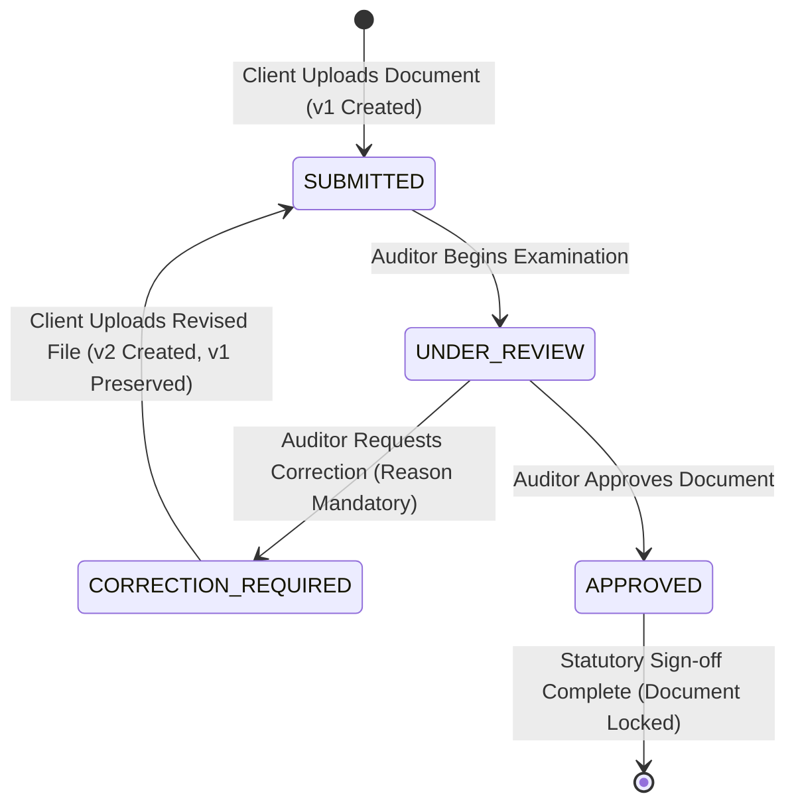

# TRACERA

> A calm, precise, document-centric audit workflow platform engineered for Chartered Accountant (CA) firms to collect, review, correct, and certify client financial records with an immutable Section 143(3) audit trail.

---

## Overview

For Chartered Accountant firms and audit practitioners, statutory audit engagements involve continuous, high-stakes document exchange. However, this workflow frequently fractures across disconnected channels:

$$\text{WhatsApp} + \text{Excel} + \text{Email} + \text{Google Drive} + \text{Manual Phone Follow-ups}$$

This fragmentation introduces critical operational and compliance failures:
- **Missing Invoices & Attachments**: Supporting documents sent across WhatsApp chats get buried without audit context or indexation.
- **Untracked Version Overwrites**: Conflicting spreadsheets named `Final_v2_edit.xlsx` overwrite previous client formulas with zero audit traceability.
- **Drowned Email Threads**: Auditor correction requests get lost in client inboxes, jeopardizing statutory filing deadlines.
- **Compliance Exposure**: Under Section 143(3) of the Companies Act, auditors must maintain tamper-evident proof of review, inquiry, and verification.

---

## Why TRACERA

TRACERA replaces fragmented communication channels with **one unified, traceable audit system**. 

| Fragmented Approach | TRACERA Approach |
| :--- | :--- |
| Unindexed WhatsApp photos & PDFs | Direct client upload portal with structured metadata & document categorization |
| Overwritten spreadsheet versions | Immutable version preservation ($v_1, v_2, v_3 \dots$)—prior files are never destroyed |
| Buried email revision requests | Prominent **Action Required** correction notices with mandatory auditor remarks |
| Verbal follow-ups & missed deadlines | Real-time notification stream, review urgency tracking, and automated reminders |
| Unsubstantiated audit opinions | Append-only chronological audit trail capturing actor, role, version, and timestamp |

---

### The CA Engagement Operating System

TRACERA elevates practice management from isolated document reviews to an integrated CA engagement lifecycle:

$$\text{CLIENT} \longrightarrow \text{ENGAGEMENT} \longrightarrow \text{WORKFLOW} \longrightarrow \text{TASKS + DOCUMENTS} \longrightarrow \text{REVIEW} \longrightarrow \text{CORRECTIONS} \longrightarrow \text{APPROVAL} \longrightarrow \text{CLOSURE} \longrightarrow \text{AUDIT TRAIL}$$

#### The Signature Audit Room Workspace (`/engagements/[id]`)
Each client audit engagement operates within a dedicated workspace featuring an interactive 10-stage gate progress bar and 8 specialized sub-tabs:

1. **Overview**: Executive portfolio summary, team ownership (Lead Partner, Practice Manager, Staff Performer), statutory due date, and billing totals.
2. **Workflow Stages**: Full sequential operational progression (from Stage 01 Acceptance to Stage 10 Closure) with owner assignment, audit notes, and stage advancement gates.
3. **Document Evidence Checklist**: 12 mandatory CA audit documents categorized into Financials, Banking, Purchases & GST, Sales, and Statutory Compliance. Auditor can issue structured document requests with due dates directly to the client.
4. **Tasks & Fieldwork**: Procedure tracking with urgency pills (`URGENT`, `HIGH`, `MEDIUM`) and active blocker alerting (e.g. `Blocked by: Client - Missing June Bank Statement`).
5. **Maker-Checker Approvals**: Enforced 3-tier sequence (Staff Performer $\rightarrow$ Manager Reviewer $\rightarrow$ Lead CA Partner Sign-off) with cryptographic audit timestamps.
6. **Billing & Fees**: Professional fee computation (Base Audit Fee ₹25,000 + 18% GST ₹4,500 = ₹29,500) with payment recording and receipt tracking.
7. **Unified Timeline**: Append-only chronological audit trail harmonizing high-level engagement milestones and granular document-level actions.
8. **Engagement Closure**: 5-point formal gate verification. When all 5 prerequisites pass, the partner seals the engagement with an immutable Closure ID (`AUD-2026-XXXXX`) and generates the official signed CA Closure Dossier PDF.

---

### Document-Level Workflow

TRACERA also enforces a strict 5-stage statutory lifecycle for individual financial records:

```
CLIENT                              AUDITOR
  │                                    │
  ├─── 01. UPLOAD (v1 Created) ───────>│ [Appears in Review Queue as SUBMITTED]
  │                                    ├─── 02. REVIEW (Starts Review → UNDER_REVIEW)
  │                                    │    (Checks 4-point CA checklist)
  │                                    │
  │<── 03. CORRECTION REQUESTED ───────┤ (Status: CORRECTION_REQUIRED with mandatory reason)
  │    (Prominent Action Required)     │
  │                                    │
  ├─── 04. RE-UPLOAD (v2 Created) ────>│ [Reappears in Review Queue at v2, v1 preserved]
  │                                    │
  │                                    ├─── 05. APPROVAL & AUDIT CERTIFICATION
  │<── Certified PDF Audit Report ─────┤    (Status: APPROVED, File Locked, PDF Generated)
```

1. **Upload**: Client submits the document (Bank Statement, Purchase Register, GST Return, Invoice). Document enters state `SUBMITTED` as Version 1.
2. **Review**: Assigned auditor opens the split-screen Review Workspace, transitioning status to `UNDER_REVIEW`. Line items are verified against the 4-point CA statutory checklist.
3. **Correction**: If discrepancies exist, auditor requests a correction with a mandatory explanation. Status transitions to `CORRECTION_REQUIRED`. Client sees an **Action Required** notice.
4. **Re-upload**: Client submits Version 2 ($v_2$). Version 1 ($v_1$) is preserved immutably.
5. **Approval**: Auditor reviews the corrected version, verifies math and counterpart data (e.g. GSTR-2B), and issues official sign-off. Status becomes `APPROVED`.
6. **Audit Trail**: Every event is permanently recorded in the Section 143(3) chronological audit ledger.

---

## Features

- **Document Management**: Centralized repository supporting PDF, XLSX, CSV, PNG, and JPG formats.
- **Strict Version Control**: Immutable preservation of every historical file version ($v_1, v_2, v_3$). Prior files and notes are never overwritten.
- **Split-Screen Review Workspace**: 60% left document canvas side-by-side with 40% right CA statutory verification panel.
- **Structured Correction Workflow**: Mandatory auditor reasoning, priority assignment, and client action alerts.
- **Section 143(3) Audit Trail**: Chronological event logs recording actor name, role, version target, timestamp, and review remarks.
- **Role-Based Portals**: Clean separation between Client Workspace, Auditor Review Console, and Admin Practice Management.
- **In-App Notifications**: Real-time bell notifications for correction requests, revision submissions, and sign-offs.
- **Automated Data Extraction & Validation**: Rule-based OCR checks for GSTIN format, arithmetic integrity, and date windows.
- **Official CA PDF Reports**: Server-side generation of signed engagement verification reports.

---

## Architecture

```
┌─────────────────────────────────────────────────────────────────────────┐
│                           TRACERA Web Client                            │
│           Next.js 16 (App Router) + React 19 + Tailwind CSS             │
│        Editorial Swiss Typography + Precision CA Workflow Layout        │
└────────────────────────────────────┬────────────────────────────────────┘
                                     │ HTTP / Cookie Session Auth
                                     ▼
┌─────────────────────────────────────────────────────────────────────────┐
│                          Next.js API Route Layer                        │
│    • Session Auth Guards (/api/auth)    • Multi-Tenant Isolation        │
│    • Workflow Action Engine             • Document Upload & Versioning  │
│    • PDF Report Generation              • In-App Event Notifications    │
└────────────────────────────────────┬────────────────────────────────────┘
                                     │
                                     ▼
┌─────────────────────────────────────────────────────────────────────────┐
│                         Central Workflow Service                        │
│   submitDocument() · startReview() · requestCorrection() ·              │
│   uploadCorrection() · approveDocument()                                │
└──────────────┬─────────────────────┬──────────────────────┬─────────────┘
               │                     │                      │
               ▼                     ▼                      ▼
┌────────────────────────┐ ┌──────────────────┐ ┌─────────────────────────┐
│ OCR Extraction Engine  │ │ Validation Rules │ │ Notification Service    │
│ (Structured Fields)    │ │ (Statutory Math) │ │ (Event Stream)          │
└────────────────────────┘ └──────────────────┘ └─────────────────────────┘
               │                     │                      │
               └─────────────────────┼──────────────────────┘
                                     ▼
┌─────────────────────────────────────────────────────────────────────────┐
│                            Persistence Layer                            │
│  • Local Persistent Store: SQLite WAL (.data/tracera.db)                │
│    (Zero-friction: pre-seeded, immediate out-of-the-box evaluation)     │
│  • Primary Cloud Database: MongoDB Atlas (Mongoose Models)              │
│  • Cloud Document Storage: Firebase Cloud Storage                       │
│  • Append-Only Audit Log: Tamper-Evident Chronological History          │
└─────────────────────────────────────────────────────────────────────────┘
```

---

## Tech Stack

- **Framework**: [Next.js 16](https://nextjs.org/) (App Router, Turbopack)
- **UI & Components**: [React 19](https://react.dev/), [Tailwind CSS](https://tailwindcss.com/), [Lucide Icons](https://lucide.dev/)
- **Typography**: [Geist Sans & Mono](https://vercel.com/font)
- **Primary Database**: [MongoDB Atlas](https://www.mongodb.com/atlas) with [Mongoose](https://mongoosejs.com/)
- **Local Zero-Friction Persistence**: [SQLite](https://www.sqlite.org/) with WAL mode via `better-sqlite3`
- **File Storage**: [Firebase Storage](https://firebase.google.com/products/storage) with local fallback
- **Authentication**: Role-based session cookies with Firebase Auth architecture
- **PDF Generation**: [jsPDF](https://github.com/parallax/jsPDF)

---

## Authentication & Authorization

### Authentication
User sessions are managed via secure HTTP-only cookies with support for Firebase Authentication tokens. Users belong to one of three roles:
- `CLIENT`: Represents client organizations (e.g. ABC Traders Pvt Ltd).
- `AUDITOR`: Represents Chartered Accountants conducting verification.
- `ADMIN`: Represents firm partners managing engagements and evaluation settings.

### Authorization (RBAC)
Server-side authorization guards are enforced on every API route and workflow transition:
- **Clients** can only view and submit documents belonging to their own `client_id`. Clients can **never** approve documents or transition documents to `UNDER_REVIEW`.
- **Auditors** can examine assigned engagement queues, issue correction notices, and approve documents. Auditors cannot upload client files.
- Cross-organization access is rejected with `403 Forbidden`.

---

## Database Schemas (MongoDB & SQLite)

The platform supports both MongoDB Atlas and SQLite WAL modes with identical data models:

1. **`users`**: User identity, role (`CLIENT` | `AUDITOR` | `ADMIN`), and organization assignment.
2. **`clients`**: Client business entities, GSTIN, and financial assessment year.
3. **`documents`**: Document records, current version pointer, active status, and reviewer assignment.
4. **`document_versions`**: Immutable version history ($v_1, v_2 \dots$), file storage paths, file sizes, and client notes.
5. **`reviews`**: Auditor decisions (`UNDER_REVIEW`, `APPROVED`, `CORRECTION_REQUIRED`), statutory checklist items, and remarks.
6. **`audit_logs`**: Append-only Section 143(3) chronological records capturing `actor_id`, `actor_name`, `actor_role`, `action`, `metadata`, and `timestamp`.
7. **`notifications`**: In-app unread alerts for revision requests and approvals.

---

## Workflow State Machine

The state machine strictly enforces valid lifecycle transitions:



### Transition Enforcement Rules:
- `SUBMITTED → APPROVED`: **BLOCKED** (Auditor must first begin review).
- `SUBMITTED → CORRECTION_REQUIRED`: **BLOCKED** (Must be in review).
- `APPROVED → SUBMITTED`: **BLOCKED** (Approved documents are permanently locked).
- `APPROVED → CORRECTION_REQUIRED`: **BLOCKED** (Cannot revise certified record).
- `CORRECTION_REQUIRED → APPROVED`: **BLOCKED** (Client must upload corrected version first).

---

## Local Setup

### 1. Clone & Install
```bash
git clone https://github.com/sukrut07/Tracera.git
cd Tracera
npm install
```

### 2. Environment Setup
```bash
cp .env.example .env.local
```
*Note: TRACERA runs immediately out of the box using the pre-configured local SQLite WAL store (`.data/tracera.db`). No cloud services are required to evaluate the complete application.*

### 3. Seed Demo Data (Optional)
```bash
npm run seed:demo
```

### 4. Start Development Server
```bash
npm run dev
```
Open [http://localhost:3000](http://localhost:3000) in your browser.

---

## Testing

TRACERA includes three comprehensive automated test suites:

### 1. CA Engagement Operating System Suite (15/15 Tests Passing)
Tests the complete 15-step CA audit lifecycle: template initiation, sequential stage advancement, document request alerts, task blocker resolution, 3-tier maker-checker sign-offs, fee settlement, 5/5 closure gate checks, and official closure dossier PDF generation:
```bash
npm run test:engagement
```

### 2. Document Workflow State Machine Suite (8/8 Tests Passing)
Tests atomic transactions, version increments, audit log immutability, and role-based permissions:
```bash
npm run test:workflow
```

### 3. Live HTTP Route & Security Suite (11/11 Tests Passing)
Tests live HTTP session auth, role authorization boundaries, multi-round reviews, notifications, and PDF report generation against the active server:
```bash
npm run test:http
```

---

## Evaluation & Synthetic Benchmark Fixtures

In accordance with evaluation guidelines, all test datasets use public synthetic benchmarks:

| Fixture | Origin / Benchmark | Test Scenario / Audit Purpose |
| :--- | :--- | :--- |
| **HDFC Current Account Q1** | [AgamiAI Indian Bank Statements](https://huggingface.co/datasets/AgamiAI/Indian-Bank-Statements) | Business banking statement with UPI, NEFT, IMPS, and RTGS clearing entries |
| **Purchase Register FY24-25 (v1)** | [Synthetic Indian Finance Data](https://github.com/AnujSureshkumar/synthetic-finance-data) | Contains missing invoice INV-204 to test **CORRECTION_REQUIRED** cycle |
| **Purchase Register FY24-25 (v2)** | [Synthetic Indian Finance Data](https://github.com/AnujSureshkumar/synthetic-finance-data) | Reconciled register with INV-204 added for auditor **APPROVAL** |
| **GSTR-2B Auto-Drafted ITC** | GST Portal Auto-Drafted ITC | Counterpart tax return data for purchase register reconciliation |
| **Balaji Enterprises Tax Invoice** | [Invoice Sandbox Benchmark](https://github.com/ciru-ai/invoice-sandbox-benchmark) | Statutory ₹76,700 GST invoice (INV-204) with HSN 7208 & E-Way Bill |
| **Form 26AS TDS Summary** | CBDT Tax Deducted at Source | Section 194C / 194J contractor & professional tax credit verification |

> [!NOTE]
> **Dedicated Evaluation Workspace**:
> To preserve the clean CA practice aesthetic, all evaluation fixture injection tools and database reset triggers are located in the dedicated **/admin/evaluation-tools** portal. The client workspace strictly shows real client documents and action-required revision notices.

---

## 9-Step Real Workflow Walkthrough

1. **Open Landing Page**: Visit [http://localhost:3000](http://localhost:3000). Inspect the editorial Swiss typography and interactive 5-stage hero workflow motion loop.
2. **Sign In as Client**: Navigate to `/login` $\rightarrow$ Select `Client: ABC Traders` (`client@demo.com`).
3. **Submit Document**: Click `+ Upload Document`. Upload a file (or select a synthetic test dataset). The document is created in `SUBMITTED` status as Version 1 ($v_1$).
4. **Switch to Auditor**: In the top navigation strip, click `Auditor` (or sign in as `auditor@demo.com`).
5. **Examine Review Queue**: Open the Review Workspace (`/auditor/dashboard`). Click `Review` on the submitted document.
6. **Request Correction**: In the split-screen console, inspect the document, check off verified checklist items, enter the reason (*"Invoice INV-204 from Balaji Enterprises is missing"*), and click `Request Correction`. Status transitions to `CORRECTION_REQUIRED`.
7. **Client Sees Action Required**: Switch back to `Client`. Observe the prominent **Action Required** banner. Click `Upload Revision (v2)`.
8. **Auditor Approves Reconciled File**: Switch to `Auditor`. Notice the document reappears in the queue as Version 2 ($v_2$). Open review, verify the added invoice, and click `Approve Document`.
9. **Inspect Chronological Audit Trail & Export PDF**: Open the document history to verify the Section 143(3) immutable trail, or click `Audit Report (PDF)` to export the official signed report.

---

## Security & Compliance Disclosure

- **Multi-Tenant Client Isolation**: All document queries are filtered by authenticated `client_id`.
- **Tamper-Evident Logs**: Audit log entries are strictly append-only. No endpoint exists to delete or modify historical logs.
- **No Unsupported Claims**: TRACERA is designed for statutory audit compliance under Section 143(3) of the Indian Companies Act; it does not make unsupported "bank-grade" marketing claims.

---

## AI & OCR Disclosure

- **Advisory Role Only**: TRACERA utilizes rule-based OCR data extraction for invoice number, GSTIN, line items, and tax arithmetic.
- **Strict Human-in-the-Loop Mandate**: AI/OCR features are strictly advisory. **AI will never automatically approve, reject, or certify an audit document.** Only a verified Chartered Accountant can issue statutory approvals.

---

## Repository & License

- **GitHub**: [https://github.com/sukrut07/Tracera](https://github.com/sukrut07/Tracera)
- **License**: MIT